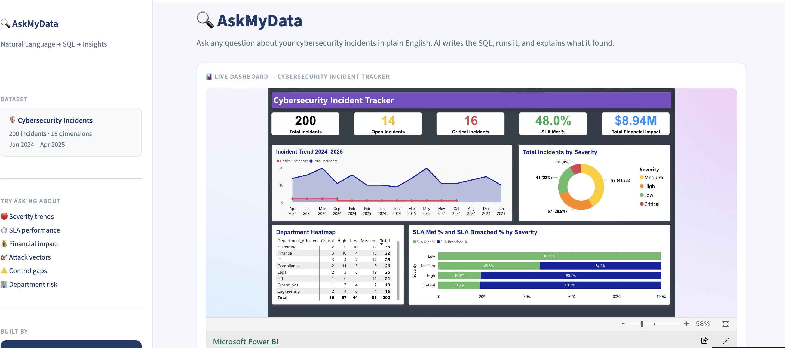
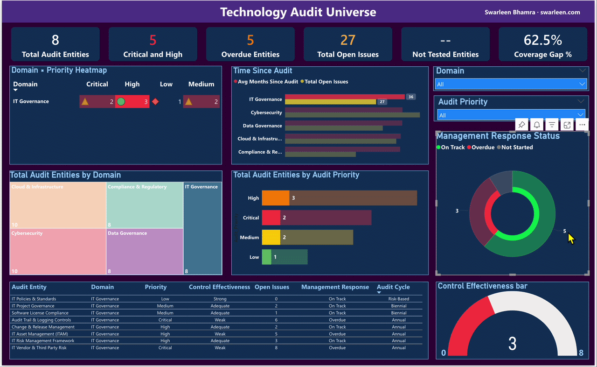
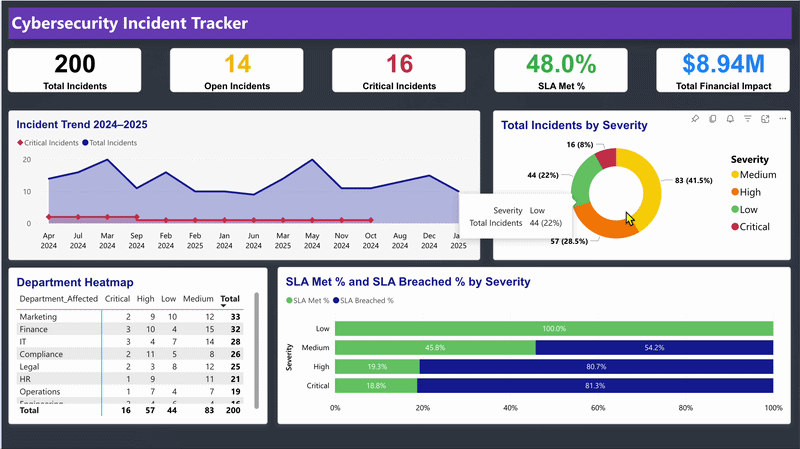
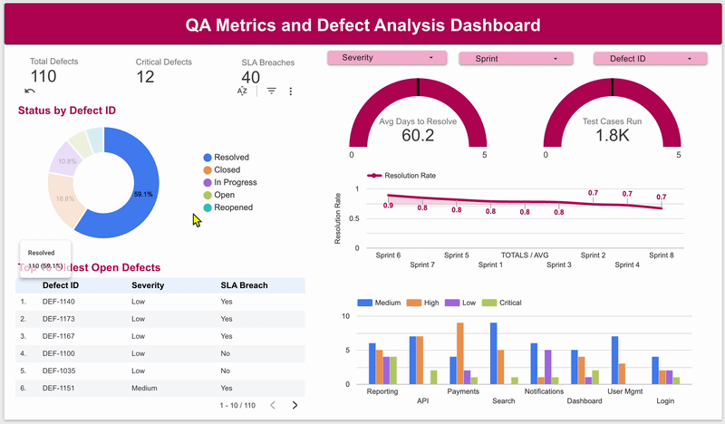

# Portfolio Projects

Welcome to my personal portfolio repository! Here you will find a collection of dashboards, data projects, and AI-powered applications that demonstrate my skills in data visualisation, business intelligence, analytics, LLM integration, QA engineering, and security testing.

## About Me

I am a Business Analyst and Data Analyst with a strong eye for security and a growing edge in AI-powered tooling. I build solutions that sit at the intersection of analytics, artificial intelligence, and business intelligence — from natural language query engines and audit analytics tools to Power BI dashboards and BA case studies. This portfolio showcases my ability to bridge business analysis, data analytics, cybersecurity awareness, AI application development, and data storytelling.

---

## 📁 Projects

---

## [Project 1: AskMyData — AI-Powered Natural Language to SQL](https://github.com/Swarleen/askmydata)

An AI-powered web application that lets anyone query a real database using plain English — no SQL knowledge required. Built with Python, Streamlit, and a Large Language Model, AskMyData converts natural language questions into executable SQL, runs them against a live database, and returns results with an AI-generated plain English insight. The full interactive Power BI cybersecurity dashboard is embedded directly inside the app.

**What it does:**
- 🤖 Natural language → SQL — LLM + prompt engineering converts any plain English question into a safe, executable SQLite query
- 💡 Insight layer — LLM interprets results and explains the "so what?" for non-technical stakeholders
- 🧠 Context awareness — understands full database schema, maps concepts to correct columns automatically
- 📊 Hybrid analytics — full Power BI dashboard embedded alongside the conversational query interface
- 🔒 Secure by design — API credentials stored in encrypted secrets vault, never exposed to users

**Built on:** 200 cybersecurity incidents · 18 dimensions · Jan 2024 – Apr 2025

### 🚀 Live App

> 💡 Click the preview above to open the live app · Right-click → Open in new tab to keep this page open

> **Tools:** Python · Streamlit · LLM · Prompt Engineering · SQLite · Pandas · Power BI · Excel

---

## [Project 2: Audit Universe Dashboard](https://github.com/Swarleen/Dashboard_AuditUniverse)

A risk-based audit planning dashboard simulating the kind of tool a Technology Audit function at a global financial institution would use to manage its audit universe. Built on 44 auditable entities across 5 technology domains — translating risk scores, control effectiveness ratings, and coverage history into a single executive-level decision-support tool.

**Key metrics tracked:**
- 🔍 44 audit entities across Cybersecurity, Cloud & Infrastructure, Data Governance, IT Governance, and Compliance & Regulatory domains
- 🔴 Critical & High priority entity concentration by domain
- ⏰ Overdue entity tracking — coverage gap % across the full universe
- 📋 150+ open issues with management response status monitoring
- ⚠️ Weak controls gauge — proportion of the universe with insufficient control effectiveness
- 🗓️ Average months since last audit — audit backlog visibility

**Key insight:** Nearly two-thirds of the audit universe is overdue for review — not a scheduling problem, an unquantified risk problem.

### 🚀 Live Dashboard

> 💡 Click the preview above to open the live dashboard · Right-click → Open in new tab to keep this page open

> **Tools:** Power BI · DAX · Power Query · Python · Excel

---

## [Project 3: Cybersecurity Incident Tracker](https://github.com/Swarleen/PowerBI-Portfolio)

An end-to-end Power BI analytics project simulating the kind of dashboard a Security Operations Centre or Technology Audit team would use to monitor, triage, and report on cybersecurity incidents across an enterprise. Built on 200 incidents across 18 dimensions spanning January 2024 – April 2025 — turning raw incident data into executive-level insights on exposure, response performance, and control gaps.

**Key metrics tracked:**
- 🛡️ 200 incidents across 10 incident types, 4 severity tiers, and 7 attack vectors
- ⏱️ SLA performance tracking — met vs breached by severity tier
- 💰 Financial impact analysis — total exposure and critical-tier concentration
- 🏢 Department × Severity heatmap — conditional formatting showing where risk concentrates
- 🔍 Control gap analysis — identifying the systemic failures behind repeat incidents
- 📈 Month-over-month trend analysis powered by DAX time intelligence

**Key insight:** MFA Not Enforced appears disproportionately in Critical-tier incidents — a single targeted control investment with outsized risk reduction potential.

### 🚀 Live Dashboard

> 💡 Right-click the image → Open in new tab to keep this page open while exploring the dashboard.

> **Tools:** Power BI · DAX · Power Query · Python · Excel

---

## [Project 4: QA Metrics Dashboard](https://github.com/Swarleen/qa-metrics-dashboard)

An interactive QA analytics dashboard tracking defect trends, SLA compliance, resolution performance, and test execution quality across 4 agile sprints for an e-commerce platform redesign. Built to make the invisible work of QA engineering fully visible — every defect, every breach, every sprint, laid out in one place.

**Key metrics tracked:**
- 🐛 60+ defects across 4 sprint cycles — volume, severity, and module breakdown
- ⏱️ SLA breach monitoring by severity tier (Critical / High / Medium / Low)
- 📈 Resolution rate trend across sprints
- ✅ Test execution coverage and pass rates by module
- 🔍 Top 10 highest risk open defects for triage prioritisation

### 🚀 Live Dashboard

> Click the image above to open the live dashboard!

> **Tools:** Looker Studio · Google Sheets · SQL

---

## [Project 5: Employee Distribution Dashboard](https://github.com/Swarleen/Employee-Distrbution)

A powerful HR analytics project that transforms over 22,000 employee records (2000–2020) into actionable insights. Leveraging PostgreSQL for robust data cleaning and Power BI for interactive visual storytelling, this dashboard uncovers critical workforce trends — from diversity and tenure to turnover and geographic distribution — helping organisations make smarter, data-driven HR decisions.

**Key metrics tracked:**
- 👥 22,000+ employee records across a 20-year period
- 📊 Workforce diversity and demographic breakdown
- 🔄 Employee turnover and tenure analysis
- 🗺️ Geographic distribution of the workforce
- 📉 Attrition trends and retention insights

### 🚀 Live Dashboard

> Click the image above to open the Project Page and view live dashboard!

> **Tools:** Power BI · PostgreSQL · DAX · Power Query

---

## [Project 6: AI-Powered Customer Service Chatbot — Loblaw](https://github.com/Swarleen/LoblawBot-ChatBot)

A full end-to-end business analysis project proposing an AI-powered chatbot to transform Loblaw's customer service operations. Covering competitive analysis, process mapping, solution design, ROI evaluation, and implementation planning — this project demonstrates the complete lifecycle of delivering a scalable, intelligent AI solution for Canada's largest food and pharmacy retailer.

**Project highlights:**
- 🏪 Problem: 1,500+ daily tickets, 24hr+ response times, 10% cart abandonment, ~$5M annual loss
- 🤖 Solution: AI chatbot with 24/7 support, real-time order tracking, and multilingual capability
- 📊 ROI Analysis: 100% ROI over 5 years — highest among all evaluated solutions
- 🔍 Competitive analysis across Sobeys, Metro, and Walmart using SWOT, PESTEL, and Balanced Scorecard
- ✅ Full requirements documentation — functional, performance, availability, and technical

### 📂 Project Documentation
- [AS-IS Process Flow](https://github.com/Swarleen/LoblawBot-ChatBot/blob/main/AS-IS_Process_Flow.md)
- [Competitive Analysis](https://github.com/Swarleen/LoblawBot-ChatBot/blob/main/Competitive_Analysis.md)
- [Evaluation Criteria](https://github.com/Swarleen/LoblawBot-ChatBot/blob/main/Evaluation_Criteria.md)
- [Solution Requirements](https://github.com/Swarleen/LoblawBot-ChatBot/blob/main/solution_requirements.md)

> **Tools:** Business Analysis · SWOT/PESTEL · Process Mapping · ROI Modelling

---

- [<ins><b>©2025 Swarleen Bhamra. All rights reserved</b></ins>]
